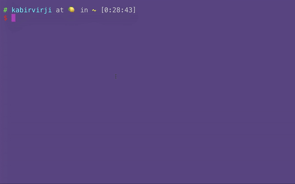
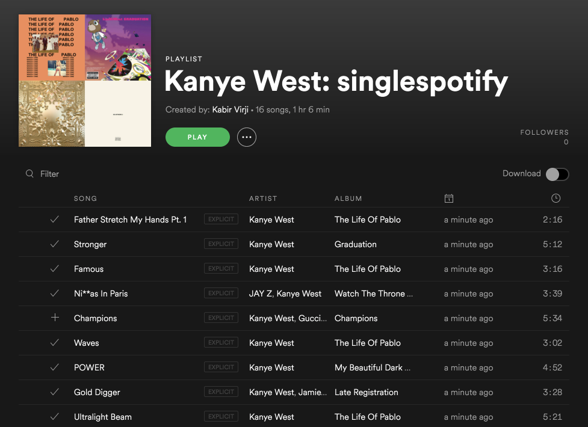

# singlespotify 🎵

> Create Spotify playlists based on one artist through the command line




<!--- 
[](https://asciinema.org/a/4k49ag6gy3bknaa6ryoubhcy5)
-->

## Install
`$ npm install -g singlespotify` <br><br>
**Note:** Node version 7.7.1+ required. `$ node -v` to check which version you have installed. The latest version can be downloaded [here](https://nodejs.org/en/)

## Usage
`$ singlespotify "artist_name"`

The program will then prompt you for your Spotify username and bearer token. <br>

You can get the bearer token here: https://developer.spotify.com/console/post-playlists/ <br>
Click **GET OAUTH TOKEN** and make sure to check *playlist-modify-public* 

`$ singlespotify --help`

```
Usage
      $ singlespotify "artist_name"
      ? Enter your Spotify username <username>
      ? Enter your Spotify bearer token <bearer>

    Options
      --name [-n] "playlist name"

    Example
      $ singlespotify "Kanye West" -n "My awesome playlist!"
      ? Enter your Spotify username kabirvirji
      ? Enter your Spotify bearer token ************************************************************

    For more information visit https://github.com/kabirvirji/singlespotify
```



## Changelog
- **03/15/17** Added [Inquirer](https://github.com/SBoudrias/Inquirer.js) and [conf](https://github.com/sindresorhus/conf) for authentication
- **03/16/17** Removed `-a` flag and added option to choose playlist name with `-n` flag
- **03/19/17** Used [update-notifier](https://github.com/yeoman/update-notifier) to notify users about updates 
- **11/03/19** Updated to accommodate API changes 


Shoutout to [kshvmdn](https://github.com/kshvmdn) for all the help!


